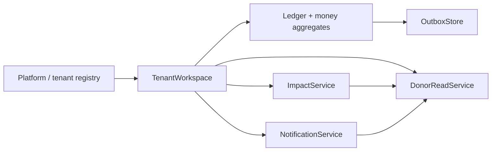

# SPEC-004 — Domain Model

## Scope

This specification documents the canonical domain model and invariants used by
Impact Relay phases 2–7.

It captures the money truth path, donor visibility model, impact events, notification
intent model, and multi-tenant boundaries that must remain stable across hosts.

## Normative references

- [HD-IR-001](HD-IR-001.md) — deterministic donation-to-receipt pilot
- [HD-IR-002](HD-IR-002.md) — public UOF export and privacy rules
- [HD-IR-004](HD-IR-004.md) — impact digests and aggregate adaptation
- [HD-IR-006](HD-IR-006.md) — public impact outcomes and raised provenance
- [HD-IR-007](HD-IR-007.md) — agent slice + human gates

## Domain ownership

Impact Relay is a **single-tenant-aware, multi-tenant-hostable** domain library.
The authoritative money and policy truth lives in domain aggregates in `src/impact_relay/domain`.
Agents and durable workers can only propose and orchestrate; they cannot alter
canonical money facts without domain validation.

The authoritative entry points are in
`src/impact_relay/domain/tenant.py`, `src/impact_relay/domain/ledger.py`,
`src/impact_relay/domain/impact.py`, `src/impact_relay/domain/notifications.py`,
and `src/impact_relay/domain/donor_views.py`.

## Aggregate boundaries

### 1) Platform / Tenant boundary

- `Platform` is the multi-tenant root.
- Every organization has one isolated `TenantWorkspace` keyed by `organization_id`.
- All donor/projected reads must pass tenant/donor ownership checks.
- Violations raise `TenantIsolationError`.

### 2) TenantWorkspace

`TenantWorkspace` is a composition boundary per org; it groups:

- `Ledger`
- `Impact` entities
- notification state (`intents`, `deliveries`, `preferences`, `consents`)
- derived read services (`DonorReadService`)

A workspace is not itself a persistence root; it is an in-memory projection backed by
storage ports.

### 3) Ledger aggregate (money truth)

`Ledger` owns donor funds and expense execution state.

Core entities:

- `Organization`
- `Donor`
- `Donation`
- `Allocation`
- `DonationAllocation`
- `Expense`
- `ExpenseAllocation`
- `DonorExpenseAttribution`
- `UseOfFundsReceipt`
- `ImpactReceipt`

Receipts generated from ledger operations are canonical and immutable; corrections
are represented as additional rows + lineage, not as overwrites.

### 4) Impact aggregate

`ImpactService` manages:

- `Program`
- `FundedAsset`
- `ImpactEvent`
- `ImpactReceipt`

Impact records are independent of donor identity in public projections and are linked
internally by event and allocation identifiers. The public suite join key is
`allocationId` (`alloc_[a-z0-9_]+`); see [CONTRACT-GOVERNANCE.md](CONTRACT-GOVERNANCE.md).

### 5) Notifications aggregate

`NotificationService` manages the consent and preference boundary:

- `ConsentRecord`
- `NotificationPreference`
- `NotificationIntent`
- `NotificationDelivery`

No outbound channel state is allowed to bypass consent and preference checks.

### 6) Read models

`DonorReadService` is a read facade and emits:

- allocation balances (`allocation_balances`)
- donor timeline (`fund_timeline`)
- canonical receipt views (`get_receipt_detail`, `list_receipts`)

Reads are non-mutating and must not alter receipts.

## Mandatory lifecycle states

### Expense lifecycle

`ExpenseState` values in domain:
`DRAFT`, `IMPORTED`, `APPROVAL_PENDING`, `APPROVED`, `RECONCILED`,
`SUPERSEDED`, `REVERSED`.

Primary progression is:

`DRAFT` -> `IMPORTED` -> `APPROVAL_PENDING` -> `APPROVED` -> (`RECONCILED` | `SUPERSEDED` | `REVERSED`).

### Receipt lifecycle

Receipt entities are immutable and carry lineage:

- `UseOfFundsReceipt`
- `ImpactReceipt`

Corrections produce new receipts and preserve prior IDs through `corrected` references
and `correction_of` lineage metadata.

### Workflow state view (agent-driven)

Workflow state machines are maintained in `workflows` and are non-authoritative
for money truth, but they must drive state transitions into domain-safe operations.
Canonical state symbols:
`RECEIVED`, `NORMALIZED`, `EVIDENCE_PENDING`, `CLASSIFICATION_PENDING`,
`REVIEW_PENDING`, `LEDGER_COMMITTED`, `RECEIPT_DRAFTED`, `PUBLICATION_PENDING`,
`PUBLISHED`, `NOTIFICATION_PENDING`, `DELIVERED`, plus terminal exception states.

## Invariants (high priority)

The following invariants are regression-gated by tests and must remain
hard guarantees unless their tests are explicitly updated with equivalent replacement
coverage.

1. **Allocation capacity**

   - Donation allocation cannot exceed cleared donation amount.
   - Un-cleared donations cannot be allocated.
   - Donor attribution cannot exceed donor allocation for the same allocation tuple.

2. **Expense accounting**

   - Expense allocations are validated to sum to expense amount before approval.
   - Restricted allocations never allow negative remaining designated balance.
   - Expense amount must be consistent with allocations and state before `publish_use_of_funds_receipt`.

3. **Receipt correctness**

   - `publish_use_of_funds_receipt` only from approved/reconciled expense state
     and with a valid attribution record.
   - Only one active live UOF receipt per `(expense_id, donation_id, allocation_id)`.
   - Receipt mutation on approved artifacts is not allowed; create new lineage instead.

4. **Attribution semantics**

   - Attribution may only occur after verification-compatible expense state.
   - Re-attributing the same donor/donation/allocation/expenditure tuple replaces prior
     amount rather than stacking.

5. **Correction behavior**

   - Corrections (`reverse_expense`, `supersede_expense`) are append-only operationally
     and preserve lineage for observability.

6. **Tenant safety**

   - Donor reads, dashboard retrieval, and donor-targeted mutations are scoped by
     `organization_id`.
   - Cross-tenant reads are denied.

7. **Simulation safety**

   - Simulation execution and dry-run paths may emit execution receipts but must not
     mutate ledger state.

## Privacy and public export boundary

The domain may retain donor IDs, internal IDs, and operator metadata internally.
Public-facing artifacts must be explicitly projected via public export pipelines,
with privacy checks ensuring:

- no donor names/emails/phones in public aggregate documents,
- public classification flags are set to `public_aggregate_only` where applicable,
- no synthetic data is misrepresented as observed live facts.

### Provenance stamps

Receipt snapshots and audit payloads carry `policy_version` and timestamp/hash fields
that establish deterministic origin and replayability.

## Deterministic evidence for this model

| Evidence | Purpose |
|---|---|
| `tests/test_ledger_invariants.py` | Core money truth checks |
| `tests/test_phases_2_6.py` | Phase 2–6 donor/impact/contracts happy-path + isolation checks |
| `tests/test_durable_ledger_log.py` and `tests/test_workflow_sql_store.py` | Append-only command-log and SQL snapshot behavior |
| `src/impact_relay/domain/tenant.py` | Multi-tenant service boundaries |

## Conformance hook

`docs/platform-conformance.yml` lists the required checks for this domain model and
cross-references the evidence files above.
