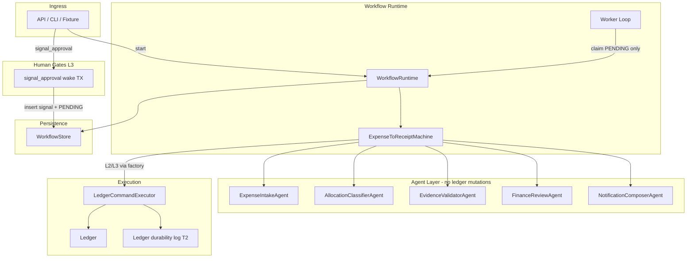
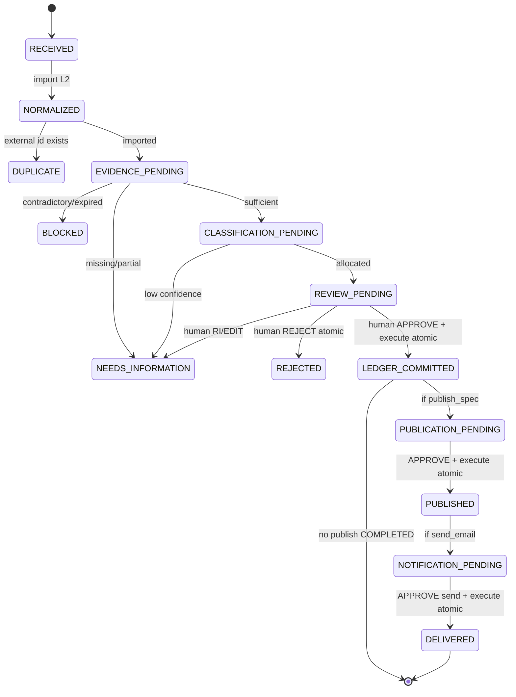
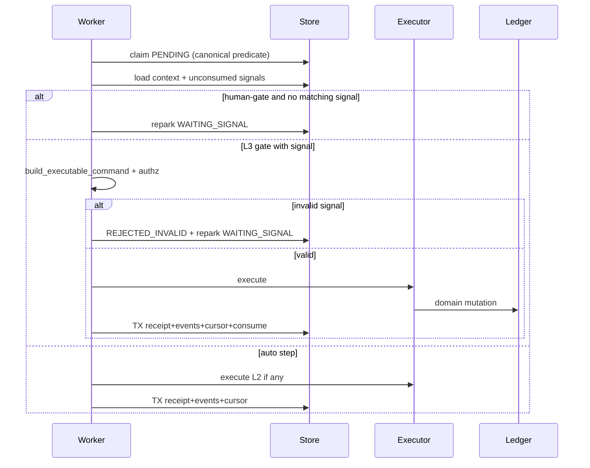
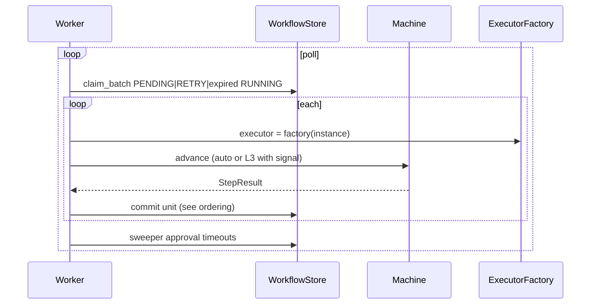
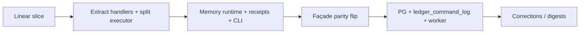

# Durable Workflow Runtime for Impact Relay

| Field | Value |
|---|---|
| **Document** | Durable Workflow Runtime (expense → receipt → notify) |
| **Author** | Impact Relay maintainers (design decisions owned by engineering lead + finance stakeholder for human-timeout policy) |
| **Date** | 2026-08-01 |
| **Status** | **Implemented** (rev 4 — MVP M1–M6 + pilot P1–P3 + later L1 correction + L2 digest skeleton on main) |
| **Target version** | **v0.6 MVP** ✓ → **Pilot** ✓ (SQLite/Postgres store + command log + worker) → **v1.0** (hardening, observability stack) |
| **Related** | HD-IR-007, `docs/architecture/AGENTIC-SYSTEM.md`, `docs/DURABLE-QUICKSTART.md`, `AGENTS.md`, `TODO.md` P1 Durable workflows |

---

## Overview

Impact Relay v0.5 ships a complete fixture-backed vertical slice — expense intake → classify → evidence → finance review packet → human `ApprovalReceipt` → ledger commit → UOF publish → email preview → independent send approval → fixture delivery — implemented as an in-process function `run_expense_approval_slice` in `src/impact_relay/agents/expense_workflow.py`. That function is single-shot: process death loses mid-flight state, human approval cannot pause/resume across restarts, and retries are not first-class.

This document designs a **durable workflow layer** that wraps the existing agent contracts and deterministic ledger without rewriting money invariants. Runtime choice for the pilot path is a **bounded PostgreSQL worker** (claim-and-advance state machine) inside the modular monolith, **gated on co-durable domain/ledger state**. Until the ledger is durable, **v0.6 MVP** delivers a full pause/resume/retry/DLQ engine against an **in-memory `WorkflowStore`**, surviving *in-process* failures and supporting operator-visible blocked cases, but **not** claiming cross-process money-path restart safety.

Temporal remains a documented upgrade path for multi-tenant scale, not the pilot default.

Human gates stay L3. Agents continue to propose only; `LedgerCommandExecutor` (relocated to a dedicated gateway module) remains the sole mutation path. Simulation mode continues to emit receipts without domain writes. Every workflow record is tenant-scoped.

---

## Background & Motivation

### Current state (v0.5 / HD-IR-007)

| Layer | Location | Behavior |
|---|---|---|
| Domain ledger | `src/impact_relay/domain/ledger.py` | Append-only money truth **in process memory** (dict stores); `approve_expense`, `publish_use_of_funds_receipt`, `reverse_expense`, `supersede_expense` |
| Agent contracts | `src/impact_relay/agents/types.py` | `WorkflowState`, `AgentCommand`, `AgentProposal`, `ApprovalReceipt`, `ExecutionReceipt`, `AgentRunReceipt` |
| Authority | `src/impact_relay/agents/authority.py` | L0–L3 gates; human-only approvers; idempotency key matching (**no** `proposal_id` check today) |
| Executor | `CommandExecutor` / `LedgerCommandExecutor` | Simulation, in-memory idempotency set, dispatch to ledger |
| Orchestration | `run_expense_approval_slice(...)` | Linear Python; batch intake then per-expense loop; approvals fabricated inline for fixtures |
| Import boundary | `tests/test_agent_import_boundaries.py` | Only `expense_workflow.py` may import `Ledger` today |

Pain points:

1. **No durability** — mid-pipeline crash loses `REVIEW_PENDING` packets and partial execution receipts.
2. **No true pause** — human approval is a function argument (`approve=True`), not an external signal that resumes a parked instance.
3. **Idempotency is process-local** — `CommandExecutor._seen_keys` dies with the process; ledger has limited entity-level protection.
4. **Blocked cases are ephemeral** — exception states exist in the enum but are not operator-visible durable records.
5. **Roadmap gap** — `ROADMAP.md` v0.6: durable retry and blocked-case handling; v1.0: durable workflow runtime; `TODO.md` P1: Temporal-or-PG, pause/resume, retry+DLQ, replay, digests, corrections.

### Constraints that must not break

- Prime directive (`AGENTS.md`): AI proposes → deterministic validate → humans approve → ledger records.
- Agents never authorize consequential action (`ENGINEERING_PRINCIPLES.md`).
- Modular monolith; no microservices (`AGENTIC-SYSTEM.md`).
- `WorkflowState` enum in `types.py` is the canonical state vocabulary.
- Ledger **money invariants** are not rewritten; only thin command dispatch + optional domain idempotency helpers.
- OIDC remains out of band for approval identity binding (MVP: CLI/fixture signals with human `approver_id`).

---

## Goals & Non-Goals

### Goals

#### v0.6 MVP (memory engine — ships without PG)

1. Model expense-to-receipt as an explicit state machine with **pause → signal → resume** on `ApprovalReceipt`.
2. Survive **in-process** failures: step retry, DLQ, blocked/rejected/duplicate as first-class states.
3. Idempotent command execution via **in-memory (then durable) execution receipt index**.
4. Preserve **simulation mode** (no domain mutation; receipts marked `SIMULATED`).
5. Preserve agent import boundary: only one gateway module may import ledger mutations.
6. Multi-tenant isolation: `tenant_id` on every workflow record, claim, and signal.
7. Migrate from `run_expense_approval_slice` without rewriting ledger or agent evaluate/validate logic.
8. Operator signal CLI + blocked-case listing for local pilot demos.

#### Pilot / v1.0 (true cross-process durability)

9. Persist workflow instances in PostgreSQL so orchestration **and** domain state survive process restarts **together**.
10. Worker claim loop with leases, wake-on-signal, approval timeouts, and dead-letter ops.

### Non-Goals

- Temporal (or any external workflow SaaS) for MVP.
- **Claiming “survive process restart for money path” while ledger remains only in-memory** (see K11).
- Full multi-tenant SaaS ledger schema on day one — **minimal durable ledger snapshot/event log is a hard co-requisite** of PG workflow pilot, not a free non-goal.
- OIDC / finance console UI (CLI + ports only for MVP).
- Autonomous approval or agent self-approval.
- Microservices, multi-region active-active.
- Production email/SMS adapters (fixture delivery remains valid).
- Changing money invariants, receipt hashing, or Privacy Sentinel rules.
- Prometheus/OpenTelemetry plumbing in v0.6 (structured logs only; metric *names* reserved for v1.0).

---

## Key Decisions

| # | Decision | Rationale |
|---|---|---|
| K1 | **Engine = bounded PostgreSQL worker for pilot; memory engine first for v0.6** | Hacker Dojo scale is low QPS and human-paced. PG is planned for domain persistence. Temporal deferred. |
| K2 | **One workflow instance per expense**; batch façade starts N instances | Matches per-expense loop after intake; simplifies claim and business keys (`external_source_id`). |
| K3 | **Steps orchestrate; effects only via `CommandExecutor`** | Preserves L0–L3 and import-boundary tests. |
| K4 | **Append-only workflow event log + mutable cursor** | Replay/audit + efficient claim. |
| K5 | **Human gates = `WAITING_SIGNAL`; wake on signal enqueue** | Claim never scans pure `WAITING_SIGNAL`. `signal_approval` atomically inserts signal and sets `PENDING` + `next_run_at=now()`. |
| K6 | **Idempotency key is durable PK for execution** | `(tenant_id, idempotency_key)` → receipt; **FAILED never stored as skip key**. |
| K7 | **`WorkflowState` + `WorkflowRunStatus` dual axes** | Business vs scheduler. |
| K8 | **Simulation is instance-scoped via `executor_factory(instance)`** | No process-global simulation flag; mixed workloads safe. |
| K9 | **Outbox deferred** | Phase 2 after API consumers. |
| K10 | **`run_expense_approval_slice` façade** | Default **`runtime`** after PR-M6 parity; rollback with `WORKFLOW_SLICE_FACADE=legacy`. |
| K11 | **Durability boundary: orchestration alone ≠ money restart safety** | True cross-process resume of L3 money commands requires co-durable ledger (minimal snapshot/event log or full PG repos). v0.6 memory runtime does not claim process-death money recovery. |
| K12 | **L3 signal handling is one atomic advance step** | Validate approval + execute (or reject path) + state transition in one step. No durable park on intermediate `APPROVED` waiting for a second claim. |
| K13 | **Approval timeout = 7 days → `NEEDS_INFORMATION` + alert** | Sweeper moves overdue `WAITING_SIGNAL` rows; not indefinite silent wait. |
| K14 | **Split `LedgerCommandExecutor` into `agents/executor.py`** | Single ledger-import gateway; workflows import executor from there only. |
| K15 | **Correction commands are explicit L3 types** | Add `reverse_expense` and `supersede_expense` to `L3_COMMAND_TYPES` (not only `correct_published_amount`). |
| K16 | **MVP authority binding = idempotency_key + human approver + tenant** | `proposal_id` is audit/wait_descriptor only until optional authority extension; SoD remains soft preference. |
| K17 | **T2 rehydrate = fold `result_json` (projection), never re-dispatch creates** | Fresh `_new_id()` on replay would break workflow `context_json` ids. Log rows are event-sourced projections. |
| K18 | **Façade `ExpenseSliceResult.workflow_state` = last instance in batch order** | Matches current single-field linear slice; per-instance states exposed on `instance_states`. Worst-case is ops `list`, not the slice field. |

### Decision log (closed open questions)

| Topic | Decision |
|---|---|
| Batch vs parent workflow | **K2**: N independent workflows per expense; façade aggregates. No parent workflow in MVP. |
| EDIT decision | Map `EDIT` → same as `REQUEST_INFORMATION` in MVP (re-packet later). |
| Approval timeout | **K13**: 7d default → `NEEDS_INFORMATION`, clear `wait_deadline`, rewrite wait for operator `RESUBMIT` only; late APPROVE on expired frozen key rejected. Alert at 72h age. |
| Ledger co-req for PG pilot | **K11**: PG workflow worker **must not** be enabled for live money path without durable ledger binding (see Durability model). |
| T2 rehydrate algorithm | **K17**: Prefer fold `result_json` into ledger structures; do not re-invoke side-effecting create paths. |
| Multi-row façade state | **K18**: last-row for `workflow_state`; `instance_states` for per-expense. |
| Temporal revisit | When >10k open workflows, multi-region, or timer complexity exceeds sweeper; earliest consideration v1.1. |
| Separation of duties | Soft (preferred distinct finance vs communications approver); hard policy reject deferred. |

---

## Durability model (restart safety)

This section is normative for implementers. It closes the “workflow PG + empty ledger” hazard.

### Three tiers

| Tier | Workflow store | Ledger / domain | Survives process death? | When |
|---|---|---|---|---|
| **T0 — Linear legacy** | none | in-memory | No | Today / `WORKFLOW_SLICE_FACADE=legacy` |
| **T1 — v0.6 MVP** | memory `WorkflowStore` | in-memory same process | **In-process only** (retry, pause/resume, DLQ while process lives) | Default development + CI |
| **T2 — Pilot durable** | PostgreSQL workflows | **Co-durable ledger** (minimal event log or snapshot; see below) | **Yes**, money + orchestration | Gated rollout; `WORKFLOW_WORKER_ENABLED` + durable ledger |

### What T1 does *not* claim

- After process exit, `REVIEW_PENDING` rows in a PG (or disk) workflow store **must not** be claimed against a freshly constructed empty `Ledger`.
- Durable `execution_receipts` alone do not rehydrate expenses/receipts.

### T2 co-durable ledger (minimum viable)

Pilot chooses **one** of the following before enabling PG claim workers on non-simulation workflows:

**Option A — Ledger command event log (preferred minimal)** — **K17**  
Append-only table `ledger_command_log` (see Data model). Written in the same commit unit as workflow cursor when using a shared DB (`commit_advance` step e).

#### Normative rehydrate algorithm (Option A) — do not re-dispatch

Naïve re-invocation of `LedgerCommandExecutor._dispatch(payload_json)` after process death is **incorrect**: ledger and executor mint fresh ids when omitted (`expense_id = row.get("expense_id") or _new_id("exp")`, allocation ids, receipt ids in `domain/ledger.py`). Workflow `context_json` / frozen commands already hold the **first-execution** ids; re-minting breaks resume.

**Write path (first successful execute only):**

1. Build and execute command as today (may mint ids).
2. Capture **`result_json`** as a full **apply record**, not only `ExecutionReceipt.output_refs`:

```json
{
  "command_type": "import_normalized_expense",
  "idempotency_key": "import:…",
  "entities": {
    "expenses": { "exp_abc": { /* full Expense asdict */ } },
    "evidence": { "ev_…": { /* … */ } },
    "expense_allocations": {},
    "attributions": {},
    "receipts": {},
    "receipt_snapshots": {},
    "external_index": { "acct_exp_slice_9101": "exp_abc" }
  },
  "audit_appended": [ { /* AuditReceipt fields */ } ],
  "output_refs": ["exp_abc"],
  "output_payload": { "expense_id": "exp_abc", "duplicate": false }
}
```

3. Persist `(tenant_id, idempotency_key, command_type, payload_json, result_json)` with `UNIQUE (tenant_id, idempotency_key)`.
4. Also upsert workflow `execution_receipts` from the same success.

**Minimum entity sets per command_type** that `result_json.entities` **must** include when that command mutates them:

| command_type | Required entity keys in `result_json.entities` |
|---|---|
| `import_normalized_expense` | `expenses[id]`, any new `evidence`, `external_index` entry |
| `allocate_expense` | `expense_allocations[id]`, updated `expenses[id]` if state changed |
| `approve_expense` | `expenses[id]` (APPROVED + approved_by) |
| `reject_expense` | optional audit only; may be empty entities |
| `publish_use_of_funds_receipt` | `attributions`, `receipts[id]`, `receipt_snapshots[id]`, expense receipt lineage list |
| `send_notification` | workspace-side: store under `notifications` / `deliveries` / `consents` keys (or separate workspace log — same fold rules) |
| `reverse_expense` / `supersede_expense` | updated expenses + any correction receipts/snapshots |

**Rehydrate path (`LedgerBinding.rehydrate(tenant_id)`):**

```text
rehydrate(tenant_id):
  1. org = load Organization for tenant (from config/fixture registry — not from log)
  2. ledger = Ledger(organization=org)   # empty in-memory stores
  3. rows = SELECT * FROM ledger_command_log
            WHERE tenant_id = :tenant_id
            ORDER BY seq ASC   -- total order of successful money commands
  4. for row in rows:
       apply_result_json(ledger, row.result_json)   # pure fold — NO _dispatch, NO _new_id
  5. rebuild derived indexes:
       - LedgerCommandExecutor._external_index from expenses.external_source_id
       - any receipt lineage maps from result_json or receipts
  6. return ledger
  7. ONLY THEN start workflow claim loop for that tenant
```

**`apply_result_json(ledger, result)` rules:**

1. For each map in `result["entities"]` (`expenses`, `evidence`, `expense_allocations`, `donations`, `donors`, `allocations`, `donation_allocations`, `attributions`, `receipts`, …): upsert by id into the corresponding `ledger.*` dict using the **exact** serialized fields (including ids, amounts as Decimal, states, hashes).
2. For `receipt_snapshots`: restore `ledger._receipt_snapshots[rid] = snapshot_dict`.
3. For `_expense_receipts` lineage: union lists from result or rebuild from receipts.
4. Append `audit_appended` entries to `ledger.audit_log` in order (or skip if audit is rebuildable — prefer append for fidelity).
5. **Never** call `import_expense` / `approve_expense` / `publish_use_of_funds_receipt` during rehydrate.
6. If `result_json` is missing or fails schema validation → **fail startup** for that tenant (do not partial-claim workflows).

**Stable ids on first execute (supporting discipline):**  
Even though rehydrate folds results (not payloads), first execute **should** prefer stable ids in payloads when known (`expense_id` in import row, packet-derived keys) so logs and context stay readable. Generated ids are still OK **if and only if** they appear in `result_json.entities` before any workflow cursor referencing them is committed (same `commit_advance` TX).

**Snapshot + tail (optional optimization):**  
Checkpoint table `ledger_snapshot (tenant_id, upto_seq, blob)` every N commands; rehydrate = load snapshot + fold log rows with `seq > upto_seq`. Same `apply_result_json` fold for the tail.

**Required pilot test (PR-P1):**

```text
1. T2 stack: start expense workflow → run to REVIEW_PENDING / WAITING_SIGNAL
2. Record expense_id from context_json and a ledger content hash (stable_hash of expenses+allocations+receipts)
3. Drop in-memory Ledger and Runtime (simulate process death); keep PG rows
4. rehydrate(tenant_id); new Runtime + worker
5. signal_approval(...); advance to LEDGER_COMMITTED
6. Assert: same expense_id; expense APPROVED; content hash lineage continuous; no duplicate expenses
```

**Option B — Periodic full aggregate snapshot**  
Serialize entire ledger aggregates (JSON/PG) after each successful money step (or periodically). `rehydrate` = deserialize blob into empty `Ledger` (also no re-dispatch). Simpler code, larger writes; still valid under K17. Reconcile `context_json.expense_id` exists in restored expenses.

**Option C — Full domain PostgreSQL repositories**  
TODO P1 storage design; supersedes A/B. Rehydrate becomes “open connection”; no in-memory fold.

### Restart runbook (T2)

1. Start process with DSN for workflows **and** ledger durability backend (`LEDGER_DURABILITY=command_log|snapshot|repos`).
2. For each active tenant: `ledger = LedgerBinding.rehydrate(tenant_id)` using **K17 fold** (Option A) or snapshot load (B/C).
3. Assert rehydrate succeeded before enabling claims for that tenant.
4. Start worker claim loop.
5. Never start worker with `WORKFLOW_ENGINE=postgres` and `LEDGER_DURABILITY=none` except for **simulation-only** tenants (startup assert).

### T1 operator runbook (no money restart)

If process dies during local demo: rebuild ledger from fixture (`build_ledger_from_fixture`), abandon or manually re-create workflow instances. CI always uses T1 same-process memory.

### Feature flags for binding

| Flag | Values | Notes |
|---|---|---|
| `WORKFLOW_ENGINE` | `memory` \| `postgres` | Store backend |
| `LEDGER_DURABILITY` | `none` \| `command_log` \| `snapshot` \| `repos` | Must not be `none` if postgres engine + non-sim worker |
| `WORKFLOW_WORKER_ENABLED` | bool | Claim loop |
| `WORKFLOW_SLICE_FACADE` | `legacy` \| `runtime` | **Default `runtime`** (PR-M6); set `legacy` to force linear driver |

Startup guard:

```python
if worker_enabled and engine == "postgres" and ledger_durability == "none":
    if any_non_simulation_tenants:
        raise RuntimeError("refusing PG worker without durable ledger (K11)")
```

---

## Proposed Design

### Architecture (modular monolith)

```text
┌──────────────────────────────────────────────────────────────────┐
│                     Impact Relay process(es)                     │
│  ┌─────────────┐  ┌──────────────────┐  ┌─────────────────────┐  │
│  │ FastAPI API │  │ Workflow Worker  │  │ CLI / fixture pilot │  │
│  │ (later)     │  │ (claim / step)   │  │                    │  │
│  └──────┬──────┘  └────────┬─────────┘  └──────────┬──────────┘  │
│         │                  │                       │             │
│         ▼                  ▼                       ▼             │
│  ┌────────────────────────────────────────────────────────────┐  │
│  │ WorkflowRuntime                                            │  │
│  │  start | signal_approval (wake) | advance | list | rehydrate│ │
│  └────────────────────────────┬───────────────────────────────┘  │
│                               │                                  │
│    ┌──────────────────────────┼──────────────────────────┐       │
│    ▼                          ▼                          ▼       │
│ Agents L0–L3          executor_factory(instance)    WorkflowStore│
│ evaluate/validate     → LedgerCommandExecutor       (mem | PG)   │
│                              │                          │        │
│                              ▼                          ▼        │
│                     Domain Ledger              workflow tables   │
│                     (+ optional durable log)   (+ signals)       │
└──────────────────────────────────────────────────────────────────┘
```



### Package layout

```text
src/impact_relay/agents/
  executor.py           # NEW: LedgerCommandExecutor (only module importing domain.ledger mutations)
  expense_workflow.py   # agents + façade re-export; no direct Ledger import after split
  ...

src/impact_relay/workflows/
  __init__.py
  types.py              # WorkflowInstance, WorkflowEvent, Signal, RunStatus, RetryPolicy
  ports.py              # WorkflowStore, Clock, IdGenerator, LedgerBinding, ExecutorFactory
  machine.py            # transition table
  expense_to_receipt.py # step handlers (import agents + agents.executor only)
  runtime.py            # start / signal_approval / advance / list
  worker.py             # claim loop, lease renewal, timeout sweeper
  store_memory.py
  store_postgres.py     # pilot track
  exceptions.py         # retryable vs terminal classification
  facade.py             # ExpenseSliceResult aggregation
  corrections.py        # later track
  digests.py            # later track
```

**Import boundary (K14, locked):**

| Module | May import `impact_relay.domain.ledger` / call mutation attrs? |
|---|---|
| `agents/executor.py` | **Yes** (sole gateway) |
| `agents/*.py` other | **No** |
| `workflows/**` | **No** ledger; may import `agents.executor.LedgerCommandExecutor` |
| tests | unrestricted |

Extend `tests/test_agent_import_boundaries.py` to scan `src/impact_relay/workflows/**` and allowlist only `agents/executor.py` for ledger imports. Split lands in **MVP PR 2** (not deferred to docs PR).

### Runtime vs domain state

```python
class WorkflowRunStatus(str, Enum):
    PENDING = "PENDING"                 # claimable
    RUNNING = "RUNNING"                 # lease held
    WAITING_SIGNAL = "WAITING_SIGNAL"   # NOT claimable until wake
    RETRY_SCHEDULED = "RETRY_SCHEDULED" # claimable when next_run_at <= now
    COMPLETED = "COMPLETED"
    FAILED_TERMINAL = "FAILED_TERMINAL"
    DEAD_LETTER = "DEAD_LETTER"
    CANCELLED = "CANCELLED"
```

| `WorkflowState` | Typical `WorkflowRunStatus` |
|---|---|
| `RECEIVED` … pre-review auto steps | `PENDING` / `RUNNING` |
| `REVIEW_PENDING` / `PUBLICATION_PENDING` / `NOTIFICATION_PENDING` | `WAITING_SIGNAL` (until signal wake) |
| `LEDGER_COMMITTED` / `PUBLISHED` (auto continuation) | `PENDING` / `RUNNING` |
| `DELIVERED` | `COMPLETED` |
| `BLOCKED` | `WAITING_SIGNAL` (operator `UNBLOCK` / resubmit) or hold |
| `NEEDS_INFORMATION` | `WAITING_SIGNAL` (operator resubmit) |
| `REJECTED` | `FAILED_TERMINAL` |
| `DUPLICATE` | `COMPLETED` (success-noop) |
| retries exhausted | `DEAD_LETTER` (preserve last `WorkflowState`) |

**Note on `APPROVED`:** The enum value `WorkflowState.APPROVED` remains available for audit events, but the **executable cursor does not park** there waiting for a second claim. Human APPROVE is handled as one atomic step ending in `LEDGER_COMMITTED` or `REJECTED` / `NEEDS_INFORMATION` (K12). Optional event: `STATE_CHANGED` may emit a transient `APPROVED` marker inside the same advance for lineage, then immediately `LEDGER_COMMITTED`.

### Expense → receipt state machine

**Order follows `run_expense_approval_slice` (evidence before classify/allocate), not the older bullet order in `AGENTIC-SYSTEM.md`.** PR-docs will align `AGENTIC-SYSTEM.md` to this order.

```text
RECEIVED
  → NORMALIZED              # L2 import_normalized_expense
  → EVIDENCE_PENDING        # L0 EvidenceValidatorAgent
  → CLASSIFICATION_PENDING  # L1 classify + L2 allocate_expense
  → REVIEW_PENDING          # L1 FinanceReview packet; WAITING_SIGNAL approve_expense
  → LEDGER_COMMITTED        # atomic: validate ApprovalReceipt + L3 approve_expense
  → RECEIPT_DRAFTED         # optional; may collapse into publish prep
  → PUBLICATION_PENDING     # WAITING_SIGNAL publish_use_of_funds_receipt
  → PUBLISHED               # atomic: validate + L3 publish
  → NOTIFICATION_PENDING    # compose preview; WAITING_SIGNAL send_notification
  → DELIVERED               # atomic: validate + L3 send

Exception paths:
  → BLOCKED | NEEDS_INFORMATION | REJECTED | DUPLICATE
```



### Step handler contract

```python
@dataclass(frozen=True)
class FrozenProposedCommand:
    """Snapshot stored at wait time — never regenerate idempotency keys on resume."""
    command_type: str
    tenant_id: str
    payload: dict[str, Any]       # as proposed (may lack approved_by)
    idempotency_key: str
    expires_at: str | None
    required_authority: str
    proposal_id: str
    agent_name: str

@dataclass(frozen=True)
class StepResult:
    next_state: WorkflowState
    run_status: WorkflowRunStatus
    events: list[WorkflowEventWrite]
    commands_to_execute: list[ExecutableCommand]
    wait_for: SignalType | None
    wait_payload: dict[str, Any]   # includes frozen_command snapshot
    wait_deadline: datetime | None  # for approval timeout sweeper
    retryable_error: str | None = None
    terminal_reason: str | None = None
    context_patch: dict[str, Any] = field(default_factory=dict)

@dataclass(frozen=True)
class ExecutableCommand:
    command: AgentCommand
    requires_approval: bool
    approval: ApprovalReceipt | None
    agent_name: str | None
    proposal: AgentProposal | None
```

Handlers re-use existing agent classes; **execute** only through `executor_factory(instance)`.

### L3 payload binding (`build_executable_command`)

On entering a wait, persist in `context_json` / events:

```json
{
  "wait": {
    "signal_type": "APPROVAL",
    "proposal_id": "prop_…",
    "command_type": "approve_expense",
    "command_idempotency_key": "approve:exp_…:pkt_…",
    "frozen_command": { "...FrozenProposedCommand..." },
    "proposal_snapshot": { "...AgentProposal jsonable..." }
  }
}
```

On signal advance:

```python
def build_executable_command(
    frozen: FrozenProposedCommand,
    approval: ApprovalReceipt,
) -> AgentCommand:
    """Rebuild exact command; overlay human identity from ApprovalReceipt."""
    if approval.command_idempotency_key != frozen.idempotency_key:
        raise AuthorityError("approval does not match frozen command_idempotency_key")
    if approval.tenant_id != frozen.tenant_id:
        raise AuthorityError("approval tenant_id mismatch")
    # proposal_id: audit-only in MVP (K16); optional hard check if policy.enforce_proposal_id
    payload = dict(frozen.payload)
    if frozen.command_type == "approve_expense":
        payload["approved_by"] = approval.approver_id
    elif frozen.command_type == "publish_use_of_funds_receipt":
        payload["actor"] = approval.approver_id
        payload.setdefault("approved_by", approval.approver_id)
    elif frozen.command_type == "send_notification":
        # frozen payload already has preview_id, content_hash, receipt_hash, receipt_id
        payload["approved_by"] = approval.approver_id
    elif frozen.command_type in ("reverse_expense", "supersede_expense", "correct_published_amount"):
        payload["actor"] = approval.approver_id
        payload.setdefault("approved_by", approval.approver_id)
    return AgentCommand(
        command_type=frozen.command_type,
        tenant_id=frozen.tenant_id,
        payload=payload,
        required_authority=AuthorityLevel.L3_HUMAN_APPROVAL,
        idempotency_key=frozen.idempotency_key,  # MUST be frozen key
        expires_at=frozen.expires_at,
    )
```

`assert_execution_authorized(command, approval, agent_name=frozen.agent_name)` runs after build.  
Preview registration for send: frozen context holds `preview_id`; runtime re-registers `EmailPreview` from context onto the per-instance executor before execute (or stores preview on workspace keyed by id durably in T2).

### Signal wake protocol (K5) — claim never sees pure WAITING_SIGNAL

**Canonical claim predicate** (single normative form — implementer copy-paste; do not use a reduced variant):

```sql
-- CANONICAL claim (memory store implements the same boolean)
SELECT * FROM workflows
WHERE next_run_at <= :now
  AND (
    run_status IN ('PENDING', 'RETRY_SCHEDULED')
    OR (run_status = 'RUNNING' AND lease_expires_at < :now)  -- expired lease reclaim
  )
  -- WAITING_SIGNAL / COMPLETED / FAILED_TERMINAL / DEAD_LETTER / CANCELLED: never claimed
ORDER BY next_run_at
FOR UPDATE SKIP LOCKED
LIMIT :batch;

-- Immediately in same TX:
UPDATE workflows SET
  lease_owner = :worker_id,
  lease_expires_at = :now + :lease_ttl,
  run_status = 'RUNNING',
  updated_at = :now
WHERE workflow_id = ANY(:claimed_ids);
```

**Canonical partial index** (supports the claim filter; reclaim of expired RUNNING may seq-scan rarely at pilot scale, or use a second index on `lease_expires_at` where `run_status = 'RUNNING'`):

```sql
CREATE INDEX workflows_claim_idx
  ON workflows (next_run_at)
  WHERE run_status IN ('PENDING', 'RETRY_SCHEDULED');

CREATE INDEX workflows_lease_reclaim_idx
  ON workflows (lease_expires_at)
  WHERE run_status = 'RUNNING';
```

**`WAITING_SIGNAL` is never claimed.**

**`signal_approval` (single store transaction):**

```python
def signal_approval(self, *, tenant_id: str, workflow_id: str, approval: ApprovalReceipt) -> None:
    inst = self.store.get(tenant_id, workflow_id)
    if inst is None or inst.tenant_id != tenant_id:
        raise NotFoundError(...)
    if inst.run_status not in (WAITING_SIGNAL, ...optional allow re-signal while PENDING with unconsumed):
        raise StateError("workflow not accepting approval signals")
    # validate rough shape early (decision enum, agent: ban) — full auth at advance
    self.store.enqueue_signal_and_wake(
        tenant_id=tenant_id,
        workflow_id=workflow_id,
        signal=WorkflowSignal(... payload=approval ...),
        # wake:
        new_run_status=WorkflowRunStatus.PENDING,
        next_run_at=now(),
        clear_lease=True,
    )
```

Memory and PG implementations of `enqueue_signal_and_wake` are atomic.

**Required test:** park at `REVIEW_PENDING`/`WAITING_SIGNAL` → drop runtime → new runtime + same store + same ledger (T1) → `signal_approval` → `advance`/`claim` → `LEDGER_COMMITTED`.

### Signal consume vs execute ordering (single advance commit)

**Human-gate states:** `REVIEW_PENDING`, `PUBLICATION_PENDING`, `NOTIFICATION_PENDING`, and operator holds `BLOCKED` / `NEEDS_INFORMATION` when waiting on `RESUBMIT` / `UNBLOCK`.

**Normative advance rules (no busy-loop):**

| Situation | Action |
|---|---|
| Human-gate state + **zero** matching unconsumed signals | Re-park `run_status=WAITING_SIGNAL`; **do not** bump `attempt_count`; release lease. (Covers empty inbox, bug, or race after wake.) |
| Signal present but invalid (authz, key, tenant, agent approver, expired frozen proposal) | `consume_result=REJECTED_INVALID`; **always** re-park `WAITING_SIGNAL`; no domain advance; no attempt bump |
| Valid APPROVE + execute **retryable** failure | Do **not** consume signal; `RETRY_SCHEDULED` + backoff; attempt_count++ |
| Valid APPROVE + execute **terminal** failure (InvariantError, hard StateError not already-applied, AuthorityError after build) | Consume signal (`FAILED_TERMINAL` or `ACCEPTED` with failed exec event); set `FAILED_TERMINAL` / `BLOCKED` / `DEAD_LETTER` per taxonomy — **never** leave bare `PENDING` + gate state |
| Valid REJECT / RI / EDIT | Consume `ACCEPTED`; transition `REJECTED` or `NEEDS_INFORMATION` + `WAITING_SIGNAL` for operator follow-up as applicable |

After pure agent evaluate (no store writes):

```text
advance_l3_or_auto(instance):
  1. If workflow_state is human-gate:
       signals = take_unconsumed_signals(tenant, workflow_id)
       matching = filter by wait_descriptor (type + idempotency_key)
       if not matching:
         repark WAITING_SIGNAL; return  # no attempt_count bump
  2. Match first valid candidate signal
  3. build_executable_command + assert_execution_authorized
     - invalid → mark REJECTED_INVALID; repark WAITING_SIGNAL; commit; return
  4. On APPROVE: executor.execute(cmd, approval=...)
     On REJECT: soft-reject if needed; next_state=REJECTED; run_status=FAILED_TERMINAL
     On REQUEST_INFORMATION | EDIT: next_state=NEEDS_INFORMATION; run_status=WAITING_SIGNAL
       (rewrite wait_descriptor to RESUBMIT/operator; new wait_deadline optional)
  5. Single commit unit (memory lock or DB TX) on success path:
       a. put_execution_receipt ONLY if status in (SUCCEEDED, SIMULATED, SKIPPED)
       b. append events (approval, execution, state_changed)
       c. update instance cursor (state, run_status, context; clear wait on leave-gate)
       d. mark_signal_consumed(ACCEPTED)  # or FAILED_TERMINAL consume on terminal exec fail
       e. T2: append ledger_command_log with full result_json (K17) if money command succeeded
  6. Retryable failure before successful commit: do not consume; RETRY_SCHEDULED
```



If crash after domain mutate but before commit (T1 window; T2 narrowed by shared TX when ledger log is in same DB): re-entry uses per-command safety table below; signal still unconsumed so advance retries; execution receipt or domain state prevents double apply.

### Per-command re-entry safety (dual-write)

| Command | Domain behavior today | Durable re-entry rule |
|---|---|---|
| `import_normalized_expense` | `_external_index` / existing expense by `external_source_id` returns duplicate | Receipt hit → SKIPPED/SUCCEEDED; else import path returns existing id as success-noop |
| `allocate_expense` | Ledger already replaces prior splits for an expense on re-allocate | Receipt hit first; else re-dispatch is safe (replace semantics) — prefer receipt short-circuit for stable `expense_allocation` ids in result_json |
| `approve_expense` | `StateError` if not in approvable states; second approve fails if already `APPROVED` | Receipt hit; else if expense already `APPROVED` with same `approved_by` → return SUCCEEDED no-op **without** re-calling mutating path; different approver → terminal conflict |
| `reject_expense` | Soft audit only | Receipt hit; else re-run soft reject (idempotent) |
| `publish_use_of_funds_receipt` | Receipt id uniqueness / attribution rules | Receipt hit; else if UOF already published for expense+donation → return existing receipt SUCCEEDED no-op |
| `send_notification` | Delivery dedup via intent keys in workspace | Receipt hit; else domain delivery idempotency; **must** have durable receipt for T2 |
| `reverse_expense` / `supersede_expense` | State machine on expense | Receipt hit; else if already `REVERSED`/`SUPERSEDED` → no-op success |

**FAILED receipts:** Durable store **must not** insert FAILED into the idempotency PK table (or must use a separate attempt log). Matches `CommandExecutor` which does not add FAILED to `_seen_keys`. Retryable failures leave no skip key; terminal failures set `FAILED_TERMINAL` / `BLOCKED` without blocking a future *different* idempotency key.

Optional ledger helpers (small, allowed in `domain/ledger.py`):

```python
def approve_expense_idempotent(self, expense_id, *, approved_by) -> Expense:
    exp = self._require_expense(expense_id)
    if exp.state == ExpenseState.APPROVED and exp.approved_by == approved_by:
        return exp
    return self.approve_expense(expense_id, approved_by=approved_by)
```

### Non-retryable exception taxonomy

| Exception / condition | Module | Worker action |
|---|---|---|
| `AuthorityError` | `agents.authority` | Terminal → `BLOCKED` or `FAILED_TERMINAL`; **do not** retry |
| `InvariantError` | `domain.types` / ledger | Terminal → `BLOCKED` / DLQ if poison; no retry |
| `StateError` | domain | Terminal unless classified as “already applied” no-op in re-entry helper |
| `AttributionError`, `NotFoundError` | domain | Terminal (missing aggregate often means rehydrate bug → DLQ + alert) |
| `ValidationStatus.BLOCKED` / `REJECTED` | agent validate | Business hold → `BLOCKED` / no auto retry |
| `ValidationStatus.NEEDS_INFORMATION` | agent validate | → `NEEDS_INFORMATION` + `WAITING_SIGNAL` |
| JSON Schema / payload validation | workflows | Terminal invalid signal or `DEAD_LETTER` |
| `OperationalError`, connection reset, lock timeout | DB driver | **Retry** with backoff |
| Timeout / 5xx from future providers | adapters | **Retry** |
| Unknown `Exception` | — | Retry with cap → `DEAD_LETTER` |

Implemented in `workflows/exceptions.py` as `classify_error(exc) -> Retryable | Terminal | AlreadyApplied`.

### Approval timeout sweeper (K13)

Separate from claim loop (or same worker tick). **Must be idempotent** — a row must match the sweeper predicate at most once per wait cycle.

```sql
UPDATE workflows
SET workflow_state = 'NEEDS_INFORMATION',
    run_status = 'WAITING_SIGNAL',
    last_error = 'approval_timeout',
    wait_deadline = NULL,              -- stop re-matching this sweeper
    timeout_applied_at = now(),        -- column: TIMESTAMPTZ NULL
    wait_descriptor = jsonb_build_object(
      'signal_type', 'RESUBMIT',
      'reason', 'approval_timeout',
      'prior_command_idempotency_key', wait_descriptor->>'command_idempotency_key',
      'prior_proposal_id', wait_descriptor->>'proposal_id'
    ),
    -- frozen L3 command cleared so late APPROVE cannot bind
    context_json = context_json - 'wait' || jsonb_build_object(
      'wait_expired', true,
      'expired_wait', context_json->'wait'
    ),
    updated_at = now()
WHERE run_status = 'WAITING_SIGNAL'
  AND wait_deadline IS NOT NULL
  AND wait_deadline < now()
  AND workflow_state IN ('REVIEW_PENDING', 'PUBLICATION_PENDING', 'NOTIFICATION_PENDING');
```

After the UPDATE, for each affected row append **one** `APPROVAL_TIMEOUT` workflow event (seq++) in the same TX when possible.

**Late APPROVE policy:** An `ApprovalReceipt` whose `command_idempotency_key` matches the **expired** frozen key is **rejected** (`REJECTED_INVALID`): wait_descriptor no longer advertises that key / `context_json.wait` is cleared. Operator must `RESUBMIT` (re-packet → new proposal + new frozen key + new `wait_deadline`) before a new APPROVE is accepted. Proposal `expires_at` and workflow `wait_deadline` are aligned at wait-entry (`min(proposal.expires_at, now+7d)` preferred).

Emit log `workflow.approval_timeout` **once per transition** (guarded by `timeout_applied_at` / event uniqueness). Do **not** auto-approve.

`wait_deadline = min(proposal.expires_at, now+7d)` when entering a human wait. Alert when `now - entered_wait_at > 72h` still waiting (including post-timeout `NEEDS_INFORMATION`).

### Worker claim loop (summary)



| Parameter | Value |
|---|---|
| `lease_ttl` | 60s |
| `poll_interval` | 1s |
| `claim_batch_size` | 10 |
| `max_attempts` per step | 5 → `DEAD_LETTER` |
| Backoff | exp 2^n s, cap 15m, jitter (**retryable only**) |
| Human `wait_deadline` | 7d (K13) |

### Simulation mode

- `WorkflowInstance.simulation: bool` only source of truth.
- Runtime holds `executor_factory: Callable[[WorkflowInstance], CommandExecutor]`.

```python
def default_executor_factory(ledger_binding: LedgerBinding):
    def factory(instance: WorkflowInstance) -> CommandExecutor:
        ledger = ledger_binding.for_tenant(instance.tenant_id)
        return LedgerCommandExecutor(
            ledger,
            simulation=instance.simulation,
            workspace=ledger_binding.workspace(instance.tenant_id),
            receipt_store=...,  # optional
        )
    return factory
```

- **Forbid** process-global simulation flag.
- Simulation instances still need a ledger for **reads** in packet assembly when not pure-fixture: use the tenant’s ledger (no writes). Façade simulation tests may use empty or preloaded ledger; mutations suppressed by executor.
- Never share one `LedgerCommandExecutor` across instances with different `simulation` values.

### Relation to existing receipts

| Artifact | Durable role |
|---|---|
| `AgentProposal` | Event + frozen in wait context |
| `ApprovalReceipt` | Signal payload then event; agents never write signals |
| `ExecutionReceipt` | Unique `(tenant_id, idempotency_key)` for success/sim/skip only |
| `AgentRunReceipt` | Terminal (and optional phase) synthesis |
| `FinanceReviewPacket` | `context_json` + event |
| Ledger entities | Financial truth (T2 co-durable) |

### Data model (PostgreSQL — pilot track)

```sql
CREATE TABLE workflows (
  workflow_id          TEXT PRIMARY KEY,
  tenant_id            TEXT NOT NULL,
  workflow_type        TEXT NOT NULL,
  business_key         TEXT NOT NULL,
  workflow_state       TEXT NOT NULL,
  run_status           TEXT NOT NULL,
  simulation           BOOLEAN NOT NULL DEFAULT FALSE,
  policy_version       TEXT NOT NULL,
  context_json         JSONB NOT NULL DEFAULT '{}',
  wait_descriptor      JSONB,
  wait_deadline        TIMESTAMPTZ,
  timeout_applied_at   TIMESTAMPTZ,
  entered_wait_at      TIMESTAMPTZ,
  attempt_count        INT NOT NULL DEFAULT 0,
  max_attempts         INT NOT NULL DEFAULT 5,
  next_run_at          TIMESTAMPTZ NOT NULL DEFAULT now(),
  lease_owner          TEXT,
  lease_expires_at     TIMESTAMPTZ,
  last_error           TEXT,
  parent_workflow_id   TEXT REFERENCES workflows(workflow_id),
  created_at           TIMESTAMPTZ NOT NULL,
  updated_at           TIMESTAMPTZ NOT NULL,
  completed_at         TIMESTAMPTZ,
  UNIQUE (tenant_id, workflow_type, business_key)
);

-- Indexes MUST match canonical claim predicate in "Signal wake protocol"
CREATE INDEX workflows_claim_idx
  ON workflows (next_run_at)
  WHERE run_status IN ('PENDING', 'RETRY_SCHEDULED');

CREATE INDEX workflows_lease_reclaim_idx
  ON workflows (lease_expires_at)
  WHERE run_status = 'RUNNING';

CREATE INDEX workflows_wait_deadline_idx
  ON workflows (wait_deadline)
  WHERE run_status = 'WAITING_SIGNAL' AND wait_deadline IS NOT NULL;

CREATE INDEX workflows_tenant_state_idx
  ON workflows (tenant_id, workflow_state, run_status);

CREATE TABLE workflow_events (
  event_id             BIGSERIAL PRIMARY KEY,
  workflow_id          TEXT NOT NULL REFERENCES workflows(workflow_id),
  tenant_id            TEXT NOT NULL,
  seq                  INT NOT NULL,
  event_type           TEXT NOT NULL,
  payload_json         JSONB NOT NULL,
  payload_hash         TEXT NOT NULL,
  created_at           TIMESTAMPTZ NOT NULL,
  UNIQUE (workflow_id, seq)
);

CREATE TABLE workflow_signals (
  signal_id            TEXT PRIMARY KEY,
  workflow_id          TEXT NOT NULL REFERENCES workflows(workflow_id),
  tenant_id            TEXT NOT NULL,
  signal_type          TEXT NOT NULL,
  payload_json         JSONB NOT NULL,
  payload_hash         TEXT NOT NULL,
  created_by           TEXT NOT NULL,
  created_at           TIMESTAMPTZ NOT NULL,
  consumed_at          TIMESTAMPTZ,
  consume_result       TEXT
);

CREATE INDEX workflow_signals_pending_idx
  ON workflow_signals (workflow_id)
  WHERE consumed_at IS NULL;

CREATE TABLE execution_receipts (
  tenant_id            TEXT NOT NULL,
  idempotency_key      TEXT NOT NULL,
  execution_id         TEXT NOT NULL,
  workflow_id          TEXT,
  command_type         TEXT NOT NULL,
  status               TEXT NOT NULL CHECK (status IN ('SUCCEEDED', 'SIMULATED', 'SKIPPED')),
  receipt_json         JSONB NOT NULL,
  created_at           TIMESTAMPTZ NOT NULL,
  PRIMARY KEY (tenant_id, idempotency_key)
);

-- T2 co-durable ledger minimum (Option A) — result_json is rehydrate source of truth (K17)
CREATE TABLE ledger_command_log (
  seq                  BIGSERIAL PRIMARY KEY,
  tenant_id            TEXT NOT NULL,
  idempotency_key      TEXT NOT NULL,
  command_type         TEXT NOT NULL,
  payload_json         JSONB NOT NULL,  -- audit / debug; NOT used to re-dispatch on rehydrate
  result_json          JSONB NOT NULL,  -- entities + audit_appended; fold-only apply
  created_at           TIMESTAMPTZ NOT NULL,
  UNIQUE (tenant_id, idempotency_key)
);
```

Multi-tenant: every store method takes `tenant_id` or loads instance first and asserts match.

---

## API / Interface Changes

### WorkflowStore protocol

```python
class WorkflowStore(Protocol):
    def create(self, instance: WorkflowInstance) -> None: ...
    def get(self, tenant_id: str, workflow_id: str) -> WorkflowInstance | None: ...
    def get_by_business_key(
        self, tenant_id: str, workflow_type: str, business_key: str
    ) -> WorkflowInstance | None: ...
    def list(
        self,
        tenant_id: str,
        *,
        workflow_state: list[str] | None = None,
        run_status: list[str] | None = None,
        limit: int = 100,
    ) -> list[WorkflowInstance]: ...
    def claim(
        self, *, worker_id: str, limit: int, now: datetime, lease_ttl: timedelta
    ) -> list[WorkflowInstance]: ...
    def update_instance(self, instance: WorkflowInstance) -> None: ...
    def append_events(
        self, tenant_id: str, workflow_id: str, events: list[WorkflowEvent]
    ) -> None: ...
    def list_events(self, tenant_id: str, workflow_id: str) -> list[WorkflowEvent]: ...
    def enqueue_signal_and_wake(
        self,
        *,
        tenant_id: str,
        workflow_id: str,
        signal: WorkflowSignal,
        new_run_status: WorkflowRunStatus,
        next_run_at: datetime,
        clear_lease: bool,
    ) -> None: ...
    def take_unconsumed_signals(
        self, tenant_id: str, workflow_id: str
    ) -> list[WorkflowSignal]: ...
    def mark_signal_consumed(
        self, tenant_id: str, signal_id: str, result: str
    ) -> None: ...
    def put_execution_receipt(
        self, receipt: ExecutionReceipt, *, workflow_id: str
    ) -> None: ...  # raises if status not in SUCCEEDED|SIMULATED|SKIPPED
    def get_execution_receipt(
        self, tenant_id: str, idempotency_key: str
    ) -> ExecutionReceipt | None: ...
    def commit_advance(self, bundle: AdvanceCommitBundle) -> None:
        """Atomic: receipts + events + instance + signal consume (+ optional ledger log)."""
        ...
```

### LedgerBinding protocol

```python
class LedgerBinding(Protocol):
    """Tenant-scoped ledger access + T2 durability. Shared by façade, worker, PR-P1."""

    def for_tenant(self, tenant_id: str) -> Ledger:
        """Return the live in-memory Ledger for this process (must be rehydrated first in T2)."""
        ...

    def workspace(self, tenant_id: str) -> TenantWorkspace | None:
        """Notification/consent workspace bound to the same ledger, if any."""
        ...

    def rehydrate(self, tenant_id: str) -> Ledger:
        """
        Build or restore Ledger for tenant.
        T1 (LEDGER_DURABILITY=none): return existing process ledger or empty+fixture load;
          no-op durability (does not read ledger_command_log).
        T2 command_log: empty Ledger + fold result_json in seq order (K17) — never re-dispatch.
        T2 snapshot/repos: load snapshot or open repository-backed ledger.
        Raises on corrupt/missing result_json (fail closed before claims).
        """
        ...

    def append_command_result(
        self,
        *,
        tenant_id: str,
        idempotency_key: str,
        command_type: str,
        payload: dict[str, Any],
        result_json: dict[str, Any],
    ) -> None:
        """T2 only: persist log row (called from commit_advance). T1: no-op."""
        ...

    def durability_mode(self) -> str:
        """none | command_log | snapshot | repos"""
        ...
```

**T1 binder:** `InMemoryLedgerBinding` holds `dict[tenant_id, Ledger]`; `rehydrate` returns `for_tenant`; `append_command_result` no-op.

**T2 binder:** `CommandLogLedgerBinding` implements K17 fold; used by worker startup and façade when `LEDGER_DURABILITY=command_log`.

### WorkflowRuntime

```python
class WorkflowRuntime:
    def __init__(
        self,
        store: WorkflowStore,
        ledger_binding: LedgerBinding,
        executor_factory: ExecutorFactory,
        clock: Clock,
    ): ...

    def start_expense_to_receipt(
        self,
        *,
        tenant_id: str,
        expense_row: dict[str, Any],
        publish_spec: dict[str, Any] | None = None,
        send_email: bool = False,
        simulation: bool = False,
        policy: TenantPolicy | None = None,
        business_key: str | None = None,
    ) -> WorkflowInstance: ...

    def signal_approval(
        self, *, tenant_id: str, workflow_id: str, approval: ApprovalReceipt
    ) -> None:
        """Insert signal + wake WAITING_SIGNAL → PENDING (atomic)."""
        ...

    def signal_operator(
        self, *, tenant_id: str, workflow_id: str, signal_type: str, payload: dict
    ) -> None: ...

    def advance_once(self, instance: WorkflowInstance) -> WorkflowInstance: ...

    def run_until_wait_or_terminal(
        self, workflow_id: str, *, tenant_id: str, max_steps: int = 50
    ) -> WorkflowInstance: ...

    def list_blocked(self, tenant_id: str) -> list[WorkflowInstance]: ...
```

### Compatibility façade (batch aggregation)

**K18 — single algorithm for `ExpenseSliceResult.workflow_state`:**

```text
workflow_state = states[-1] if states else BLOCKED
  where states[i] is the terminal/cursor WorkflowState of instance i
  in batch row order (same order as expense_rows / imported_ids today)
```

Do **not** compute worst-case into `ExpenseSliceResult.workflow_state` (that would change multi-row meaning vs the linear slice, which overwrote a single `workflow` variable per loop and thus reflected the **last** expense). Ops “any blocked?” uses `store.list` or the new aggregate field below.

```python
@dataclass
class ExpenseSliceResult:
    workflow_state: WorkflowState          # K18: last instance only
    instance_states: list[tuple[str, WorkflowState]]  # (workflow_id or expense_id, state)
    # ... existing fields ...

def run_expense_approval_slice_via_runtime(...) -> ExpenseSliceResult:
    """
    Preferred intake: one batch ExpenseIntakeAgent.evaluate + L2 imports on shared ledger,
    then for each imported expense_id / row (batch order):
      1. start_expense_to_receipt at NORMALIZED with expense_id in context
         (or start_expense_to_receipt(row) if single-row intake path)
      2. run_until_wait_or_terminal
      3. If approve and WAITING at REVIEW_PENDING: signal_approval(synthetic) + pump
      4. Similarly for publish/send if specs request
    Aggregate:
      packets, proposals, validations, approvals, executions from all instances' events
      receipts, public_previews, email_previews, delivery_refs union
      instance_states: full per-instance list
      workflow_state: instance_states[-1][1]   # K18 last-row only
      run_receipt: single orchestrator AgentRunReceipt over combined lists
    """
```

### Executor change

- Optional `receipt_store` on `CommandExecutor`.
- Before dispatch: return stored success/sim/skip receipt.
- After success/sim: `put_execution_receipt`.
- Never store FAILED in receipt_store.
- `LedgerCommandExecutor` lives in `agents/executor.py`.

---

## Data Model Changes

- Workflow tables: pilot track (above).
- `ledger_command_log`: T2 co-req Option A.
- Domain ledger code: optional idempotent helpers; no money invariant changes.
- Migration from slice: extract handlers → memory runtime → receipts → CLI → (pilot) PG + ledger log.

---

## Alternatives Considered

### Alternative 1: Temporal from day one

Pros: mature durability, timers, visibility.  
Cons: ops surface before OIDC/PG domain; overkill for pilot QPS.  
**Verdict:** Later. Ports via store/runtime boundaries, not a formal `WorkflowEngine` plugin in MVP.

**Temporal adapter constraints (when revisited):**

- Workflow functions must be **deterministic** (no ledger I/O, no clock, no random); only orchestrate.
- **Activities** wrap: agent evaluate/validate, `CommandExecutor.execute`, signal waits via Temporal signals mapped 1:1 to `ApprovalReceipt`.
- Activities **must be idempotent** using the same `(tenant_id, idempotency_key)` receipt store.
- Activities must use `executor_factory` / L3 gates — never call `ledger.approve_expense` raw.
- Versioning: workflow task queues pinned per policy_version breaking changes.
- Migration cost from PG worker is non-trivial (rewrite orchestration in Temporal DSL; retain handlers as activities).

### Alternative 2: Bounded PostgreSQL worker (pilot choice under K11)

Pros: aligns with PG stack; full control; memory path for CI.  
Cons: hand-rolled leases/DLQ; must co-build ledger durability.  
**Verdict:** Pilot path after T2 co-req.

### Alternative 3: Status column on expenses only

Rejected — conflates domain with orchestration; weak audit/pause.

---

## Security & Privacy Considerations

| Threat | Severity | Mitigation |
|---|---|---|
| Agent forges `ApprovalReceipt` | Critical | Signals only via operator CLI/API; schema bans `agent:`; executor authz |
| Cross-tenant signal/claim | High | tenant_id on all methods; wake asserts tenant |
| Resume against empty ledger | Critical | K11 startup guard; T2 rehydrate |
| Double send on replay | High | Durable receipt + domain delivery dedup |
| Simulation mix-up | High | `executor_factory(instance)` only |
| Weak proposal_id binding | Medium | K16 audit-only MVP; optional hard check later |
| SoD same human finance+send | Low–Med | Soft preference; Open Question deferred as product policy |

**MVP approval validation (explicit):**

Uses existing `assert_execution_authorized`: tenant, decision==APPROVE for execute, `command_idempotency_key`, human `approver_id`, not self-agent.  
Does **not** check `proposal_id` or role allow-list unless `policy.enforce_proposal_id` / role gates added later. wait_descriptor still stores `proposal_id` for audit and console display.

---

## Observability

### v0.6 MVP

Structured logs only (no Prometheus client, no OTel SDK):

```json
{
  "event": "workflow.step.completed",
  "tenant_id": "hacker-dojo",
  "workflow_id": "wf_…",
  "workflow_type": "expense_to_receipt",
  "from_state": "REVIEW_PENDING",
  "to_state": "LEDGER_COMMITTED",
  "run_status": "PENDING",
  "command_type": "approve_expense",
  "simulation": false,
  "duration_ms": 42
}
```

Log counters (parseable): `workflow.dead_letter`, `workflow.approval_timeout`, `workflow.retry`, `workflow.claim`.

### v1.0 (reserved names)

| Metric | Labels |
|---|---|
| `impact_relay_workflow_instances` | tenant, type, state, run_status |
| `impact_relay_workflow_step_duration_seconds` | type, step, result |
| `impact_relay_workflow_approvals_total` | tenant, decision, command_type |
| … | as previously listed |

### Alert definitions (product requirements; wire when metrics exist)

- Dead-letter > 0 for 15m
- Oldest human wait > 72h
- Claim lag > 5m for PENDING
- Cross-tenant denials spike
- Startup refused PG worker without ledger durability

---

## Rollout Plan

### Tracks

| Track | Scope | ROADMAP |
|---|---|---|
| **MVP (v0.6)** | Memory store, machine, atomic L3, receipt index, retry/DLQ, signal CLI, blocked list, façade behind flag, replay tests | “durable retry and blocked-case handling” |
| **Pilot** | PG store, worker, ledger_command_log (or snapshot), ops runbook, simulation+live fixture | toward v0.9/v1.0 |
| **Later** | Corrections workflow, digests, outbox, Temporal adapter, OTel/Prometheus | v1.0+ |

### Feature flags

| Flag | Default | Effect |
|---|---|---|
| `WORKFLOW_ENGINE` | `memory` | Store |
| `LEDGER_DURABILITY` | `none` | K11 |
| `WORKFLOW_WORKER_ENABLED` | `false` | Claim loop |
| `WORKFLOW_SLICE_FACADE` | **`runtime`** | Rollback: `export WORKFLOW_SLICE_FACADE=legacy` |

### Parity checklist (PR-M6 — complete)

- [x] All `tests/test_expense_approval_slice.py` pass on runtime façade
- [x] Parity suite `tests/test_workflow_facade_parity.py` (legacy vs runtime)
- [x] Simulation non-mutation
- [x] Contradictory → BLOCKED
- [x] Signal invalid / agent approver rejected
- [x] Import boundary including workflows/

### Rollback

- Façade → `legacy`
- Disable worker
- Ledger truth unchanged by workflow tables alone

---

## Correction and Retraction Workflow (later track)

`workflow_type=correction`.

```text
DISCREPANCY_REPORTED → CORRECTION_PROPOSED → REVIEW_PENDING (WAIT L3)
  → LEDGER_CORRECTION → RECEIPT_CORRECTION → NOTIFY_AFFECTED → COMPLETED
```

**L3 command types (K15)** — update `types.py` `L3_COMMAND_TYPES` and `AuthorityPolicy.l3_command_types`:

```python
L3_COMMAND_TYPES = frozenset({
    "approve_expense",
    "reject_expense",
    "publish_use_of_funds_receipt",
    "send_notification",
    "publish_public_evidence",
    "change_attribution_policy",
    "correct_published_amount",  # generic amount correction if needed
    "reverse_expense",           # NEW — maps ledger.reverse_expense
    "supersede_expense",         # NEW — maps ledger.supersede_expense
})
```

`LedgerCommandExecutor._dispatch`:

- `reverse_expense` → `ledger.reverse_expense(expense_id, actor=..., reason=...)`
- `supersede_expense` → `ledger.supersede_expense(...)` with replacement payload

Behavioral oracle: `tests/test_receipts_and_corrections.py`.  
Do **not** treat reverse/supersede as L1 with only `correct_published_amount` name confusion — explicit types prevent missing `ApprovalReceipt`.

---

## Scheduled Digest Workflow (later track)

`next_run_at` scheduling; assemble → privacy gate → optional approval → complete. After expense path T2.

---

## Outbox (optional later)

Skip MVP; consumers use `list` / events.

---

## Testing Strategy

| Test | Covers |
|---|---|
| `test_workflow_machine.py` | Transitions; atomic L3; no park on APPROVED |
| `test_workflow_replay.py` | Crash injection between commit substeps (memory fault injector); resume |
| `test_workflow_signals.py` | Wake PENDING; wrong tenant; agent approver; key mismatch; invalid consume; no matching signal → repark (no busy-loop); REJECTED_INVALID → WAITING_SIGNAL |
| `test_workflow_retry.py` | Retryable vs terminal taxonomy; DLQ; FAILED not in receipt store |
| `test_workflow_timeout.py` | wait_deadline cleared; sweeper idempotent (no re-fire); late APPROVE rejected; NEEDS_INFORMATION |
| `test_expense_approval_slice.py` | Façade parity when flag runtime; last-row workflow_state (K18) |
| `test_agent_import_boundaries.py` | executor.py gateway + workflows ban |
| T2 integration | K17 fold rehydrate: same expense_id after kill; signal → LEDGER_COMMITTED; no duplicate entities |

---

## Migration Path from `run_expense_approval_slice`



---

## Open Questions (remaining)

1. **T2 ledger option A vs B vs full repos timing** relative to TODO P1 storage — recommend Option A (`command_log` + K17 fold) in same pilot epic as PG workflows.
2. **Hard SoD** (same human cannot approve finance and send) — product policy.
3. **`policy.enforce_proposal_id`** — when to promote from audit-only.

~~4. Multi-row façade aggregation~~ — **closed: K18 last-row** + `instance_states`.

---

## References

- `docs/architecture/AGENTIC-SYSTEM.md` — modular monolith; Temporal preferred / PG OK; **note evidence/classify order drift vs this doc**
- `AGENTS.md`, `ENGINEERING_PRINCIPLES.md`, `ROADMAP.md`, `TODO.md`
- `src/impact_relay/agents/expense_workflow.py`, `types.py`, `base.py`, `authority.py`
- `src/impact_relay/domain/ledger.py` — mutations and corrections
- `schemas/agents/approval-receipt.schema.json`
- `tests/test_expense_approval_slice.py`, `test_agent_import_boundaries.py`, `test_receipts_and_corrections.py`

---

## PR Plan

Split into **MVP (v0.6)**, **Pilot**, and **Later**. Each PR independently reviewable.

### MVP track (v0.6) — durable retry, pause/resume, blocked cases

#### PR-M1 — Workflow types and ports

- **Title:** `workflows: add WorkflowInstance types, RunStatus, and store ports`
- **Files:** `src/impact_relay/workflows/types.py`, `ports.py`, `exceptions.py` (taxonomy stubs), `__init__.py`; unit tests
- **Dependencies:** none
- **Description:** Dataclasses, `WorkflowRunStatus`, `AdvanceCommitBundle`, error classification enums. No agent behavior change.

#### PR-M2 — Split executor + extract step handlers

- **Title:** `agents: split LedgerCommandExecutor; extract expense-to-receipt steps`
- **Files:** `agents/executor.py` (move `LedgerCommandExecutor`), `expense_workflow.py` re-exports, `workflows/expense_to_receipt.py`, `machine.py`; **extend** `test_agent_import_boundaries.py` for workflows + sole gateway; keep slice tests green via linear driver calling handlers
- **Dependencies:** PR-M1
- **Description:** K14 import boundary locked early. Pure extraction of intake/evidence/classify/review/publish/send steps.

#### PR-M3 — Memory store, runtime, receipt index, signal wake, façade (flagged)

- **Title:** `workflows: memory runtime with atomic L3, wake-on-signal, and receipt index`
- **Files:** `store_memory.py`, `runtime.py`, `facade.py`; wire optional `receipt_store` on `CommandExecutor`; `WORKFLOW_SLICE_FACADE` default **`legacy`**
- **Dependencies:** PR-M2
- **Description:**  
  - `signal_approval` → enqueue + wake `PENDING`  
  - Atomic advance commit ordering  
  - `build_executable_command`  
  - In-memory execution receipt index (FAILED never stored)  
  - `run_until_wait_or_terminal`  
  - Façade batch aggregation (opt-in flag)  
  - Tests: replay, signals, retry taxonomy, simulation, duplicate, blocked  
  **Replay tests ship here** with memory receipt index (not deferred).

#### PR-M4 — Memory worker loop + retry/DLQ + timeout sweeper

- **Title:** `workflows: in-process worker, backoff, dead-letter, approval timeout`
- **Files:** `worker.py`, CLI hook to run worker in-process; tests with fault injection
- **Dependencies:** PR-M3
- **Description:** Claim PENDING/RETRY from memory store; leases optional in memory (single-threaded OK); max attempts → DLQ; wait_deadline sweeper (K13). No PostgreSQL.

#### PR-M5 — Operator signal CLI + blocked-case listing

- **Title:** `workflows: CLI to signal approvals and list blocked/DLQ cases`
- **Files:** `workflows/cli.py` or extend `impact_relay/cli.py`; uses memory or configured store
- **Dependencies:** PR-M3 (can parallelize after M3; before or with M4)
- **Description:** Pilot-demo human gates without OIDC; `list` filtered by BLOCKED/DEAD_LETTER/WAITING_SIGNAL. Ships on **MVP track**, not after PG.

#### PR-M6 — Façade default flip (parity)

- **Title:** `workflows: switch WORKFLOW_SLICE_FACADE default to runtime`
- **Files:** flag default one-liner; CI parity checklist job
- **Dependencies:** PR-M3–M5 green + checklist
- **Description:** Dedicated tiny PR; easy revert.

### Pilot track — true cross-process durability

#### PR-P1 — Ledger command log (or snapshot) binding

- **Title:** `domain/workflows: minimal durable ledger_command_log + rehydrate`
- **Files:** `ledger_command_log` migration; `LedgerBinding` + `CommandLogLedgerBinding`; `apply_result_json`; startup guards (K11/K17)
- **Dependencies:** PR-M3 concepts; can follow M-track
- **Description:** Hard co-requisite before PG worker on live money path. **Normative rehydrate = fold `result_json` only (never re-dispatch).** Capture full entity maps on first execute. Tests: kill after `REVIEW_PENDING`, rehydrate, `signal_approval`, assert same `expense_id` + ledger lineage.

#### PR-P2 — PostgreSQL WorkflowStore + Alembic

- **Title:** `workflows: PostgreSQL store, claim SQL, schema`
- **Files:** `store_postgres.py`, migrations, optional `db` deps; skip tests without DSN
- **Dependencies:** PR-M3 (protocol), PR-P1 for non-sim e2e
- **Description:** SKIP LOCKED claim; `enqueue_signal_and_wake` TX; execution_receipts CHECK status; tenant isolation tests.

#### PR-P3 — Production worker process + ops runbook

- **Title:** `workflows: durable worker entrypoint and restart runbook`
- **Files:** `python -m impact_relay.workflows.worker`, docs section in this file / HD-IR notes; metrics logs
- **Dependencies:** PR-P1, PR-P2, PR-M4 patterns
- **Description:** Enable `WORKFLOW_WORKER_ENABLED` only with durability guard; runbook for rehydrate.

### Later track

#### PR-L1 — Correction workflow + L3 command types — **done**

- **Title:** `workflows: correction workflow; L3 reverse_expense/supersede_expense`
- **Files:** `types.py` L3 set, `executor.py` dispatch, `corrections.py`, tests vs `test_receipts_and_corrections.py`
- **Dependencies:** PR-M3 minimum; ideally PR-M5 for operator signal
- **Description:** K15 security fix for corrections; not in v0.6 exit gate. **Landed** (PR #19).

#### PR-L2 — Scheduled digest skeleton — **done**

- **Title:** `workflows: scheduled digest run skeleton`
- **Dependencies:** Pilot worker useful for timers
- **Description:** Minimal assemble → privacy → optional ack → complete. **Landed** (PR #20).

#### PR-L3 — Docs alignment — **this rev**

- **Title:** `docs: align AGENTIC-SYSTEM step order; mark ROADMAP/TODO items`
- **Files:** `AGENTIC-SYSTEM.md` evidence-before-classify; `TODO.md` / `ROADMAP.md` checkboxes; this doc status
- **Dependencies:** after M-track lands
- **Description:** Remove doc drift; no code.

#### PR-L4 — Observability stack (v1.0)

- **Title:** `obs: Prometheus metrics and OTel spans for workflows`
- **Dependencies:** Pilot
- **Description:** Implement reserved metric names; wire alerts.

---

## Revision History

| Date | Change |
|---|---|
| 2026-08-01 | Initial draft |
| 2026-08-01 | Rev 2: design review — durability tiers K11, signal wake, atomic L3, payload binding, claim/timeout, L3 corrections, PR re-cut, taxonomy, import split, façade batch, store list APIs, obs MVP scope, Temporal adapter notes |
| 2026-08-01 | Rev 3: K17 deterministic result_json fold rehydrate; sweeper clears wait_deadline; human-gate repark rules; K18 last-row façade; LedgerBinding protocol; single canonical claim SQL |
| 2026-08-01 | Rev 4: status → Implemented; pilot P1–P3 + PR-L1 correction + PR-L2 scheduled digest landed; docs alignment (PR-L3) |
